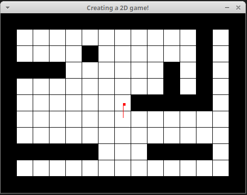

# Criando um mapa 2D com um player

Neste tutorial vamos ver como criar um mapa 2D a partir de um _grid_ pré fornecido e também como inserir um jogador nesse mapa que pode se movimentar livremente pelo ambiente respeitando a colisão com as paredes. É uma implementação bem básica e pede absurdamente por uma refatoração! :sweat_smile: 

## Introdução

Antes de começar a codar de fato, vamos definir algumas coisas para facilitar nossa vida. Vamos criar três grupos de macros, os valores definidos podem ser alterados:

1. **Cores** no formato 0xRRGGBB (Red, Green, Blue) para usarmos no nosso mapa (plano de fundo, bordas, player, etc);
2. **Keycodes** referentes as teclas: ESC (usado para encerrar a janela), → (usado para mover a direção para direita), ← (usado para mover a direção para esquerda), ↑ (usado para se mover para frente) e ↓ (usado para se mover para baixo);
3. Algumas informações referentes a **janela**.

Feito isso, vamos definir três estruturas:

1. **t_img**: estrutura responsável por lidar com a imagem que estamos exibindo, ela contém um ponteiro para imagem, um ponteiro para os dados, um int para bpp, size_line e endian (valores necessários na função **mlx_get_data_addr**);
2. **t_player**: estrutura responsável por lidar com nosso jogador. Um jogador tem uma coordenada no mapa (**x** e **y**), um raio, duas direções (esquerda ou direita), dois caminhos para andar (frente e trás), um ângulo de rotação e uma velocidade de movimentação e de ângulo. Todas essas informações devem estar na struct;
3. **t_game**: por fim, a estrutura do jogo deve ter todos os elementos pro jogo funcionar, ou seja, o ponteiro **mlx**, o ponteiro para nossa janela, nossa imagem, nosso jogador e um mapa.

Exemplo do código feito:

```c
//Bibliotecas úteis
#include <mlx.h>
#include <string.h>
#include <stdio.h>
#include <stdlib.h>
#include <math.h>

//Definindo algumas cores
# define RED 0xFF0000
# define BLACK 0x000000
# define WHITE 0xFFFFFF
# define GREEN 0x006600
# define BLUE 0x0000FF

//Definindo nossas keycodes
# define KEYCODE_EXIT 65307 //ESC
# define UP_ARROW 65362 //↑
# define DOWN_ARROW 65364 //↓
# define RIGHT_ARROW 65363 //→
# define LEFT_ARROW 65361 //←

//Informações referentes a janela
# define TILE_SIZE 32 //tamanho de cada "quadrado" em nossa malha/grid
# define PLAYER_TILE_SIZE 5 //tamanho do jogador (o quanto ele ocupa no quadrado)
# define MAP_NUM_ROWS 11 //total de linhas
# define MAP_NUM_COLS 15 //total de colunas
# define WINDOW_WIDTH MAP_NUM_COLS*TILE_SIZE //largura da janela
# define WINDOW_HEIGHT MAP_NUM_ROWS*TILE_SIZE //altura da janela

//infos referentes a nossa imagem, campos conforme documentação
typedef struct s_img
{
	void *img_ptr;
	int *data;
	int bpp;
	int size_line;
	int endian;
} t_img;

//infos pertinentes sobre o player
typedef struct s_player {
	int x;
	int y;
	int radius;
	int turnDirection;
	int walkDirection;
	float rotationAngle;
	float moveSpeed;
	float rotationSpeed;
} t_player;

//infos relacionadas ao "jogo"
typedef struct s_game
{
	void *mlx;
	void *win;
	t_img img;
	t_player player;
	int map[MAP_NUM_ROWS][MAP_NUM_COLS];
} t_game;
```

Agora que tudo isso foi criado, podemos ir para o código.

## Lidando com o mapa

Agora que já temos nossa struct para o mapa, lidar com ele fica mais simples. Primeiro de tudo devemos inicializar nosso mapa, atribuindo uma matriz ao nosso **grid**. Feito isso, podemos começar a criar nossa função para renderizar o mapa que é bem simples, o algoritmo é:

```txt
enquanto eu estiver percorrendo a matriz:
	se eu encontrar "1":
		desenho um quadrado parede (na cor preta por exemplo)
	senão:
		desenho um quadrado vazio (na cor branca por exemplo)
```

Com a função de renderizar pronta, basta copiarmos para a memória nosso grid e renderiza-lo para assim inicializarmos.

Exemplo de código feito:

```c
//1 = parede, 0 = espaço vazio
int grid[MAP_NUM_ROWS][MAP_NUM_COLS] = {
            {1, 1, 1, 1, 1, 1, 1, 1, 1, 1, 1, 1, 1, 1, 1},
            {1, 0, 0, 0, 0, 0, 0, 0, 0, 0, 0, 0, 1, 0, 1},
            {1, 0, 0, 0, 0, 1, 0, 0, 0, 0, 0, 0, 1, 0, 1},
            {1, 1, 1, 1, 0, 0, 0, 0, 0, 0, 1, 0, 1, 0, 1},
            {1, 0, 0, 0, 0, 0, 0, 0, 0, 0, 1, 0, 1, 0, 1},
            {1, 0, 0, 0, 0, 0, 0, 0, 1, 1, 1, 1, 1, 0, 1},
            {1, 0, 0, 0, 0, 0, 0, 0, 0, 0, 0, 0, 0, 0, 1},
            {1, 0, 0, 0, 0, 0, 0, 0, 0, 0, 0, 0, 0, 0, 1},
            {1, 1, 1, 1, 1, 1, 0, 0, 0, 1, 1, 1, 1, 0, 1},
            {1, 0, 0, 0, 0, 0, 0, 0, 0, 0, 0, 0, 0, 0, 1},
            {1, 1, 1, 1, 1, 1, 1, 1, 1, 1, 1, 1, 1, 1, 1}
};

//iniciando nosso mapa
void map_init(t_game *game) {
	memcpy(game->map, grid, sizeof(int) * MAP_NUM_ROWS * MAP_NUM_COLS);
	renderMap(game);
}

//desenhando cada tile nosso, color1 = cor da borda (stroke), color2 = cor do tile
void draw_pixels_of_tile(t_game *game, int row, int col, int color1, int color2)
{
	int tile_row, tile_col;

	row *= TILE_SIZE;
	col *= TILE_SIZE;
	tile_row = 0;
	while (tile_row < TILE_SIZE)
	{
		tile_col = 0;
		while (tile_col < TILE_SIZE)
		{
			if (tile_row == TILE_SIZE - 1 || tile_col == TILE_SIZE - 1)
				game->img.data[(tile_row + row) * WINDOW_WIDTH + (tile_col + col)] = color1;
			else
				game->img.data[(tile_row + row) * WINDOW_WIDTH + (tile_col + col)] = color2;
			tile_col++;
		}
		tile_row++;
	}
}

//basicamente: percorre o mapa e se for parede (1) deixa
//tudo preto, senão faz pinta de branco com bordas pretas
int renderMap(t_game *game) {
	int row, col;

	row = 0;
	while (row < MAP_NUM_ROWS)
	{
		col = 0;
		while (col < MAP_NUM_COLS)
		{
			if (game->map[row][col] == 1)
				draw_pixels_of_tile(game, row, col, BLACK, BLACK);
			else
				draw_pixels_of_tile(game, row, col, BLACK, WHITE);
			col++;
		}
		row++;
	}

	return (1);
}

//função que realiza a colisão com as paredes
int hasWallAt(int x, int y) {
	if (x < 0 || x > WINDOW_WIDTH || y < 0 || y > WINDOW_HEIGHT) return 1;
	int mapGridIndexX = floor(x / TILE_SIZE);
	int mapGridIndexY = floor(y / TILE_SIZE);
	return grid[mapGridIndexY][mapGridIndexX] != 0;
}
```

## Lidando com o player

Criamos já nossa struct do player, mas ela está sem nenhum valor, logo a primeira coisa que devemos fazer é atribuir valores. Com isso só ficará faltando uma função responsável por atualizar a posição do player e outra para desenhar o player no mapa.

Exemplo de código feito:

```c
//inicializando o player com dados iniciais
//o 3.14 pode ser substituido pela macro M_PI presente
//na lib <math.h>
void player_init(t_game *game) {
	game->player.x = WINDOW_WIDTH / 2;
	game->player.y = WINDOW_HEIGHT / 2;
	game->player.radius = 3;
	game->player.turnDirection = 0; // -1 se esquerda, +1 se direita
	game->player.walkDirection = 0; // -1 se trás, +1 se frente
	game->player.rotationAngle = 3.14 / 2;
	game->player.moveSpeed = 7.0;
	game->player.rotationSpeed = 2 * (3.14 / 180);
}

//essa função funciona igual a uma para desenhar um quadrado
//futuramente alterar para desenhar um círculo
void draw_player(t_game *game, int x, int y, int color)
{
    int dx;
    int dy;
 
    dy = 0;
    while (dy < PLAYER_TILE_SIZE)
    {
        dx = 0;
        while (dx < PLAYER_TILE_SIZE)
        {
            game->img.data[WINDOW_WIDTH * (y + dy) + (x + dx)] = color;
            dx++;
        }
        dy++;
    }
}

//função responsável por atualizar informações pertinentes a movimentação do player
void update(t_game *game) {
	float moveStep = game->player.walkDirection * game->player.moveSpeed;

	float newPlayerX = game->player.x + cos(game->player.rotationAngle) * moveStep;
	float newPlayerY = game->player.y + sin(game->player.rotationAngle) * moveStep;

	if (!hasWallAt(newPlayerX, newPlayerY)) {
		game->player.x = newPlayerX;
		game->player.y = newPlayerY;
	}
}
```

## Funções auxiliares

Para evitar colocar muito código no main, foram criadas duas funções de inicialização: uma para o minilibx e outra para a imagem. Também precisamos de uma função para interpretar o que deve ser feito quando o usuário aperta uma tecla e quando ele solta ela. A função para desenhar linha também é útil na hora de renderizarmos a direção do jogador.

Exemplo de código feito:

```c
//inicializando o mlx
void minilibx_init(t_game *game)
{
	game->mlx = mlx_init();
	game->win = mlx_new_window(game->mlx, WINDOW_WIDTH, WINDOW_HEIGHT, "Creating a 2D game!");
}

//inicializando nossa imagem
void img_init(t_game *game)
{
	game->img.img_ptr = mlx_new_image(game->mlx, WINDOW_WIDTH, WINDOW_HEIGHT);
	game->img.data = (int *)mlx_get_data_addr(game->img.img_ptr, &game->img.bpp, &game->img.size_line, &game->img.endian);
}

//definindo o que deve acontecer sempre que soltamos a tecla
int	keyRelease(int keyCode, t_game *game) {
	if (keyCode == UP_ARROW) {
		game->player.walkDirection = 0;
	} else if (keyCode == DOWN_ARROW) {
		game->player.walkDirection = 0;
	} else if (keyCode == RIGHT_ARROW) {
		game->player.turnDirection = 0;
		game->player.rotationAngle += game->player.turnDirection * game->player.rotationSpeed;
	} else if (keyCode == LEFT_ARROW) {
		game->player.turnDirection = 0;
		game->player.rotationAngle += game->player.turnDirection * game->player.rotationSpeed;
	}

	return (1);
}

//definindo o que deve acontecer sempre que apertamos alguma tecla
int	keyPressed(int keyCode, t_game *game) {
	if (keyCode == UP_ARROW) {
		game->player.walkDirection = 1;
		update(game);
	} else if (keyCode == DOWN_ARROW) {
		game->player.walkDirection = -1;
		update(game);
	} else if (keyCode == RIGHT_ARROW) {
		game->player.turnDirection = 1;
		game->player.rotationAngle += game->player.turnDirection * game->player.rotationSpeed;
	} else if (keyCode == LEFT_ARROW) {
		game->player.turnDirection = -1;
		game->player.rotationAngle += game->player.turnDirection * game->player.rotationSpeed;
	} else if (keyCode == KEYCODE_EXIT) {
		exit(0);
	}

	return (1);
}

//função para desenhar a linha que indica a direção do jogador
int draw_line(t_game *game, int beginX, int beginY, int endX, int endY, int color) {
	double deltaX = endX - beginX;
	double deltaY = endY - beginY;

	int pixels = sqrt((deltaX * deltaX) + (deltaY * deltaY));

	deltaX /= pixels;
	deltaY /= pixels;

	double pixelX = beginX;
	double pixelY = beginY;

	while (pixels) {
		game->img.data[WINDOW_WIDTH * (int)floor(pixelY) + (int)floor(pixelX)] = color;
		pixelX += deltaX;
		pixelY += deltaY;
		--pixels;
	}

	return (1);
}

```

## Escrevendo o main

Tá quase tudo pronto, agora só falta o main para rodar de fato. Como estaremos "ouvindo" e atualizando constantemente o jogador com base no que o úsuario aperta, então precisamos de um loop que será encarregado de desenhar essas alterações na imagem. Feito isso basta colocar todas as funções de inicialização e de hook no main :smile:

Exemplo de código feito:

```c
int draw_loop (t_game *game) {
	map_init(game);
	draw_line(game, game->player.x, game->player.y, game->player.x + cos(game->player.rotationAngle) * 30, game->player.y + sin(game->player.rotationAngle) * 30, RED);
	draw_player(game, game->player.x, game->player.y, RED);
	mlx_put_image_to_window(game->mlx, game->win, game->img.img_ptr, 0, 0);
	return 0;
}

int main(void)
{
	t_game game;

	minilibx_init(&game);
	img_init(&game);
	player_init(&game);
	mlx_hook(game.win, 2, 1L<<0, keyPressed, &game);
	mlx_hook(game.win, 3, 1L<<0, keyRelease, &game);
	mlx_loop_hook(game.mlx, draw_loop, &game);
	mlx_loop(game.mlx);

	return (0);
}
```

## Resultado

