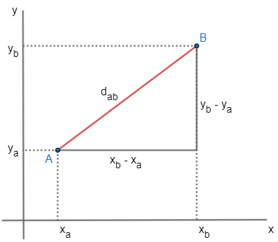
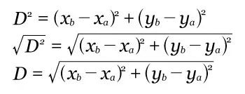

# Desenhando uma linha na janela

Agora que sabemos como colocar um pixel em nossa janela, vamos avançar e tentar fazer uma linha em qualquer ângulo. O minilibX não tem uma função pronta para isso e cabe a nós codarmos. Para a nossa função **draw_line** devemos considerar estes pontos:

- A função **mlx_pixel_put** exige os parâmetros mlx e win, logo nossa função também precisará deles. Outro ponto a ser observado é que ela desenha um pixel a partir de uma dada coordenada (x, y), e o que uma linha é? Uma ligação entre dois pontos/duas coordenadas (x1,y1) e (x2,y2), dessa forma precisaremos passar 4 parâmetros que indicam: X do ínicio, Y do ínicio, X do final e Y do final.
- O outro ponto é que precisamos de uma cor para a linha ser visível.

**OBS:** A função mlx_pixel_put poderia ser substituida pela função que insere imagem :speak_no_evil:

Assim, o protótipo da função pode ser dado por:
```c
int draw_line(void *mlx, void *win, int beginX, int beginY, int endX, int endY,int color)
```

Se por exemplo fizessemos uma chamada assim:
```c
draw_line(mlx, win, 10, 10, 20, 10, 0xFFFFFF);
```
Devemos visualizar uma linha branca que vai do ponto (10,10) ao (20,10), ou seja, uma linha horizontal (já que o Y se mantém) de 10 pixels de comprimento.

## Vamos à matemática!
Precisamos relembrar um pouco sobre trigonometria antes de começar. Digamos que tenhamos dois pontos A e B de coordenadas (Xa, Ya) e (Xb, Yb) respectivamente. Como sabemos a distancia de A até B? Vamos observar a imagem abaixo:

{:style="display: block; margin: 0 auto;"}

Observe que podemos aplicar o teorema de pitágoras (hipotenusa² = adjacente² + oposto²) e com isso chegamos a fórmula que é:

{:style="display: block; margin: 0 auto;"}

Agora podemos voltar ao código.

## Escrevendo a função

Conforme a fórmula, vemos que precisamos calcular dois deltas (um valor menos o outro), no caso um delta para o X (Xb - Xa) e outro para o Y (Yb - Ya). Ao calcular isso, além de utilizarmos na fórmula posteriormente, podemos usar para saber quantos pixels teremos que desenhar para o X e para o Y. Assim temos:

```c
//descobrindo os deltas
double deltaX = endX - beginX;
double deltaY = endY - beginY;

//aplicando a fórmula
int pixels = sqrt((deltaX * deltaX) + (deltaY * deltaY));

//descobrindo quantos pixels deverão ser desenhados
deltaX /= pixels;
deltaY /= pixels;
```

Com isso, basta um loop e nossa função está pronta!

```c
//definindo nosso ponto de partida para o X e para o Y
double pixelX = beginX;
double pixelY = beginY;

//loop até não percorrermos toda a distância
while (pixels)
{
    mlx_pixel_put(mlx, win, pixelX, pixelY, color);
    pixelX += deltaX;
    pixelY += deltaY;
    --pixels;
}
```

A nossa função main fica assim:

```c
int main()
{
    void *mlx = mlx_init();
    void *win = mlx_new_window(mlx, 640, 360, "Tutorial Window - Draw Line");

    draw_line(mlx, win, 640, 360, 0, 0, 0xFFFFFF);

    mlx_loop(mlx);
}
```