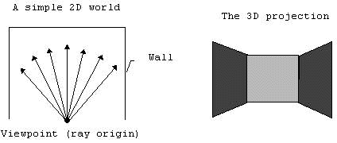

# Raycasting

O fenômeno do _ray-casting_ começou com o lançamento do jogo Wolfenstein 3D em 1992. Nesse jogo, o jogador é alocado em um labirinto 3D como ambiente e ele/ela deve encontrar uma saída enquanto batalha com múltiplos oponentes. Wolfenstein 3D se tornou um clássico devido sua rapidez e suavidade na animação. O que possibilitou esse tipo de animação foi uma abordagem inovadora da renderização 3D conhecida como **ray-casting**.

## O que é ray-casting?

Ray-casting é uma técnica que transforma uma forma limitada de dado (como um mapa bem simples ou uma planta) em uma projeção 3D ao traçar os raios a partir de um ponto de vista. Por exemplo, o ray-casting tansforma a figura A na figura B conforme mostrado abaixo.

{:style="display: block; margin: 0 auto;"}

**OBS**: Essa não é a única aplicação do raycasting, ele também pode ser usado para renderizar terrenos (ver figura abaixo). O importante é somente lembrar que o "ray-casting" traça raios a partir do visualizador até os objetos.

{:style="display: block; margin: 0 auto;"}

## Ray-casting vs Ray-tracing

Assim como o ray-casting, o ray-tracing determina a visibilidade de superfícies traçando raios de luz imaginários a partir de um ponto de vista até o objeto em uma cena.

Olhando assim parece que ray-casting e ray-tracing são a mesma coisa. Na perspectiva de programadores, ray-casting é uma implementação especial (subclasse) do ray-tracing.

Essa distinção acontece porque de forma geral o ray-casting é mais rápido que o ray-tracing. Isso é possível porque o ray-casting usa algumas limitações geométricas para acelerar o processo de renderização. Por exemplo: as paredes **são sempre perpendiculares** com o chão. 

| RAY-CASTING | RAY-TRACING |
|-|-|
|**Princípio**: raios são cálculados e traçados em grupos baseado em limitações geométricas. Por exemplo: em um display de resolução 320x320, um ray-caster traça apenas 320 raios (o número 320 vêm do fato que o display tem uma resolução de 320 pixels horizontais, consequentemente 320 colunas verticais).  |**Princípio**: cada raio é traçado separadamente, então cada ponto (geralmente um pixel) no display é traçado por um raio. Por exemplo: em um display com resolução 320x320, um ray-tracer precisa traçar 320x320 (64.000) raios (isso é cerca de 200 vezes mais lento que o ray-casting).  |
|**Fórmula**: em muitos casos, inexata.  |**Fórmula**: em muitos casos, exata.  |
|**Velocidade**: muito rápido se comparado com o ray-tracing. Viável para processamento em tempo real.  |**Velocidade**: lenta, inviável para processamento em tempo real.  |
|**Qualidade**: a imagem não é muito realista. Frequentemente elas são um bloco.  |**Qualidade**: a imagem é muito realista.  |
|**Mundo**: limitado por uma ou mais limitações geométricas (somente figuras geométricas simples).  |**Mundo**: praticamente qualquer figura pode ser renderizada.  |
|**Armazenamento**: pequeno, as imagens renderizadas não são armazenadas no disco. Normalmente, apenas o mapa é armazenado.  |**Armazenamento**: imagens renderizadas são armazenadas no disco e carregadas quando necessário.  |
| |  |

## Limitações do raycasting

Já saabemos que o ray casting é rápido porque utiliza limitações geométricas. Em muitos casos, as paredes sempre fazem 90 graus com o chão. Outra limitação existente é que um ponto de vista não pode ser rotacionado pelo eixo Z. Se isso fosse permitido, então as paredes poderiam ser inclinadas e o benefício de desenhar em pedaços verticais seria perdido. Essa inabilidade de rotacionar pelo eixo Z é uma das razões pelo qual o ambiente ray-casting não é considerado um ambiente real 3D.

Em um ambiente ray-casting, o jogador pode se mover para frente, trás e rotacionar para esquerda ou direita, mas não pode rotacionar pelo eixo Z conforme mostra a figura abaixo:

{:style="display: block; margin: 0 auto;"}
