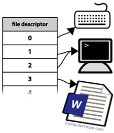
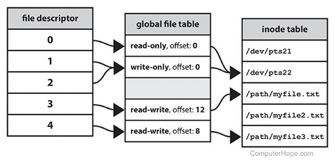

# Descritores de arquivos (File Descriptor)

{:style="float: right;margin-right: 7px;margin-top: 7px;"}

Um descritor de arquivo é um número que identifica exclusivamente um arquivo aberto no sistema operacional de um computador. Ele descreve um recurso de dados e como esse recurso pode ser acessado.

Quando um programa pede para abrir um arquivo - ou outro recurso de dados, como um soquete de rede -, o kernel:

1. Concede acesso.
2. Cria uma entrada na tabela de arquivos global.
3. Fornece ao software o local dessa entrada.

O descritor é identificado por um número inteiro não negativo exclusivo , como 0, 12 ou 567. Existe pelo menos um descritor de arquivo para cada arquivo aberto no sistema.

Os descritores de arquivo foram usados ​​pela primeira vez no Unix e são usados ​​pelos sistemas operacionais modernos, incluindo Linux , macOS e BSD . No Microsoft Windows , os descritores de arquivo são conhecidos como identificadores de arquivo.

## Visão geral

Quando um processo faz uma solicitação bem-sucedida para abrir um arquivo, o kernel retorna um descritor de arquivo que aponta para uma entrada na tabela de arquivos global do kernel. A entrada da tabela de arquivos contém informações como o inode do arquivo, deslocamento de bytes e as restrições de acesso para esse fluxo de dados ( somente leitura, somente gravação, etc.).

{:style="display: block; margin: 0 auto;"}

## stdin, stdout e stderr

Em um sistema operacional semelhante ao Unix, os três primeiros descritores de arquivos, por padrão, são STDIN ( entrada padrão ), STDOUT (saída padrão) e STDERR (erro padrão).

## Redirecionando descritores de arquivo

Os descritores de arquivo podem ser acessados ​​diretamente usando o bash , o shell padrão do Linux, macOS X e Windows Subsystem for Linux.

Por exemplo, quando você usa o comando find , a saída bem-sucedida vai para stdout (descritor de arquivo 1) e as mensagens de erro vão para stderr (descritor de arquivo 2). Ambos os fluxos são exibidos como saída do terminal:

```shell
find / -name '*something*'
```

Estamos recebendo erros porque o find está tentando pesquisar alguns diretórios do sistema que não temos permissão para ler. Todas as linhas que dizem “Permissão negada” foram gravadas em stderr e as outras linhas foram gravadas em stdout.

Você pode ocultar o stderr redirecionando o descritor de arquivo 2 para / dev / null, o dispositivo especial no Linux que “não leva a lugar algum”:

```shell
find / -name '*something*' 2>/dev/null
Os erros enviados para / dev / null e não são exibidos.
```

Compreender a diferença entre stdout e stderr é importante quando você deseja trabalhar com a saída de um programa. Por exemplo, se você tentar grep a saída do comando find, notará que as mensagens de erro não são filtradas, porque apenas a saída padrão é canalizada para grep.

```shell
find / -name '*something*' | grep 'something'
```

No entanto, você pode redirecionar o erro padrão para a saída padrão e o grep processará o texto de ambos:

```shell
find / -name '*something*' 2>&1 | grep 'something'
```

## Referência

- [File Descriptor](https://www.computerhope.com/jargon/f/file-descriptor.htm)