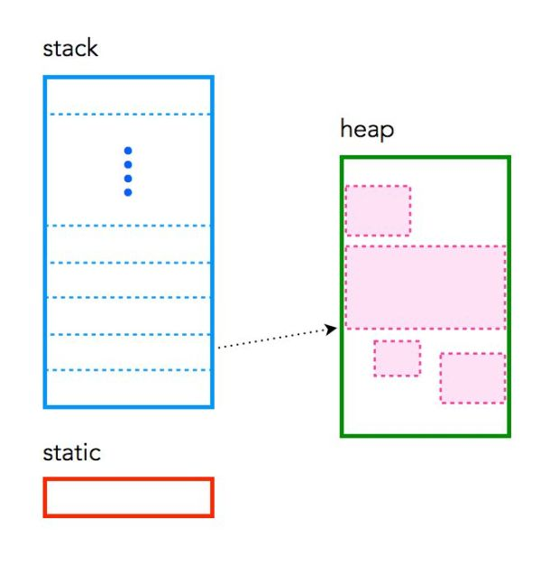
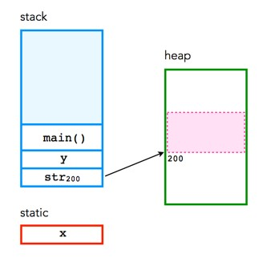
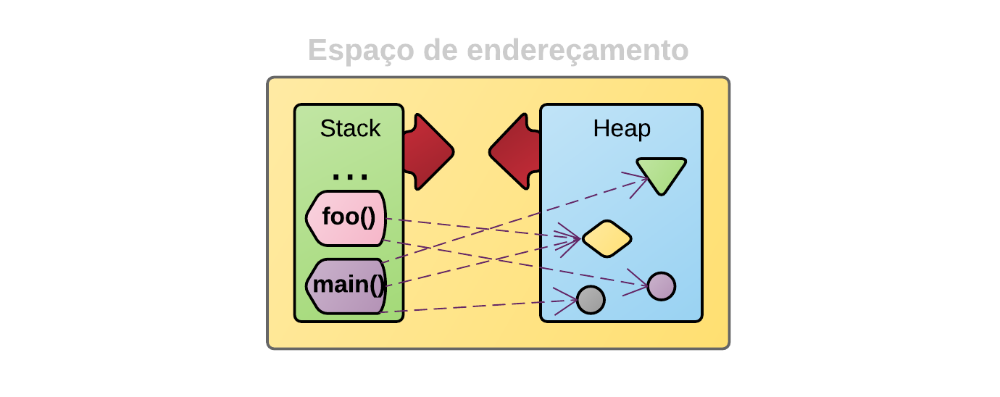

# Memória em C

O C é tão entrelaçado com a memória que o programador tem uma boa compreensão de onde vai cada coisa. C tem três conjuntos diferentes de memória:
- **static**: armazenamento variável global, permanente para toda a execução do programa.
- **stack**: armazenamento variável local (memória automática e contínua).
- **heap**: armazenamento dinâmico (grande conjunto de memória, não alocado em ordem contígua).



## Memória estática (Static memory)
A memória estática persiste por toda a vida útil do programa e geralmente é usada para armazenar itens como variáveis globais ou variáveis criadas com a cláusula static. Por exemplo:
```c
int mochileiro;
```
Em muitos sistemas, essa variável usa 4 bytes de memória. Se uma variável for declarada fora de uma função, ela será considerada global, o que significa que pode ser acessada em qualquer lugar do programa. As variáveis globai são estáticas e há apenas uma cópia para o programa inteiro. Dentro de uma função a variável é alocada na pilha. Também é possível forçar uma variável a ser estática usando a cláusula static. Por exemplo, a mesma variável criada dentro de uma função usando a cláusula static permitiria que ela fosse armazenada na memória estática.
```c
static int galaxias;
```

## Memória de pilha (Stack memory)
A pilha é usada para armazenar variáveis ​​usadas no interior de uma função (incluindo a função main () ). É um LIFO, “ L AST- I n, - F irst- O ut”, estrutura. Toda vez que uma função declara uma nova variável, ela é “empurrada” para a pilha. Então, quando uma função termina a execução, todas as variáveis ​​associadas a essa função na pilha são excluídas e a memória que elas usam é liberada. Isso leva ao escopo “local” das variáveis ​​de função. A pilha é uma região especial da memória e gerenciada automaticamente pela CPU - para que você não precise alocar ou desalocar memória. A memória da pilha é dividida em quadros sucessivos, onde cada vez que uma função é chamada, ela se aloca um novo quadro da pilha.

Observe que geralmente há um limite no tamanho da pilha - que pode variar com o sistema operacional (por exemplo, o OSX atualmente tem um tamanho de pilha padrão de 8 MB). Se um programa tentar colocar muitas informações na pilha, ocorrerá um estouro de pilha . O estouro de pilha acontece quando toda a memória da pilha foi alocada e outras alocações começam a transbordar para outras seções da memória. O estouro de pilha também ocorre em situações em que a recursão é usada incorretamente.

Um resumo da pilha:
- a pilha é gerenciada pela CPU, não há capacidade de modificá-la
- variáveis ​​são alocadas e liberadas automaticamente
- a pilha não é ilimitada - a maioria tem um limite superior
- a pilha cresce e diminui à medida que as variáveis ​​são criadas e destruídas
- as variáveis ​​de pilha existem apenas enquanto a função que as criou existir

## Heap memory
A pilha é o oposto diametral da pilha. O heap é um grande conjunto de memória que pode ser usado dinamicamente - também é conhecido como “armazenamento gratuito”. Esta é a memória que não é gerenciada automaticamente - você precisa alocar explicitamente (usando funções como malloc) e desalocar (por exemplo, liberar) a memória. Se você não liberar a memória quando terminar, isso resultará no que é conhecido como vazamento de memória - memória que ainda está sendo “usada” e não estará disponível para outros processos. Ao contrário da pilha, geralmente não há restrições no tamanho da pilha (ou nas variáveis ​​que ela cria), além do tamanho físico da memória na máquina. Variáveis ​​criadas na pilha estão acessíveis em qualquer lugar do programa.

**Ah, e a memória heap exige que você use ponteiros!!!**

Um resumo da pilha:
- o heap é gerenciado pelo programador, a capacidade de modificá-lo é um tanto sem limites
- em C, variáveis ​​são alocadas e liberadas usando funções como malloc () e free ()
- a pilha é grande e geralmente é limitada pela memória física disponível
- a pilha requer ponteiros para acessá-lo

## Exemplo
```c
#include <stdio.h>
#include <stdlib.h>

int x;          

int main(void) 
{
    int y;   
    char *str; 

    y = 4;
    printf("stack memory: %d\n", y);

    str = malloc(100*sizeof(char)); 
    str[0] = 'm';
    printf("heap memory: %c\n", str[0]); 
    free(str);         
    return 0;
}
```

A variável x é armazenamento estático, devido à sua natureza global. Ambos y e str são armazenamento dinâmico pilha que está desatribuído quando as extremidades do programa. A função malloc () é usada para alocar 100 partes de armazenamento dinâmico de heap, cada um do tamanho de char, para str . Por outro lado, a função free () desaloca a memória associada ao str.



## Memória heap e stack
O sistema operacional ao carregar um programa na memória disponibiliza ao programa um espaço de endereçamento. Esse espaço é a memória disponível para aquele programa. O Heap, ou área de alocação dinâmica, é um espaço reservado para variáveis e dados criados durante a execução do programa (runtime). Vamos dizer que o Heap é a memória global do programa.

Já a pilha de funções (stack) é uma área da memória que aloca dados/variáveis ou ponteiros quando uma função é chamada e desalocada quando a função termina. Podemos dizer então que representa a memória local àquela função.



## Referências

- [Memória em C (em inglês)](https://craftofcoding.wordpress.com/2015/12/07/memory-in-c-the-stack-the-heap-and-static/)
- [Memória heap vs stack (em inglês)](https://blog.pantuza.com/artigos/heap-vs-stack)