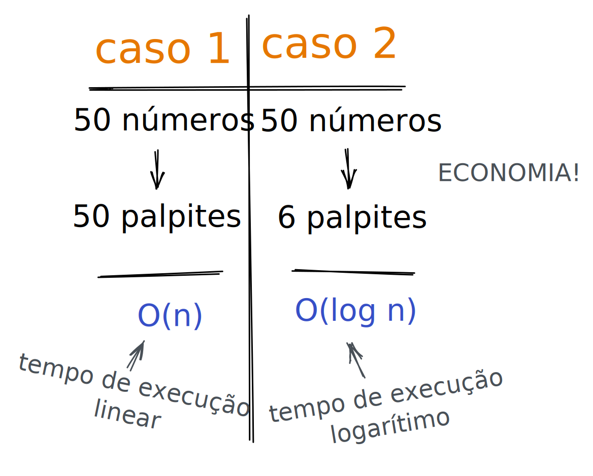
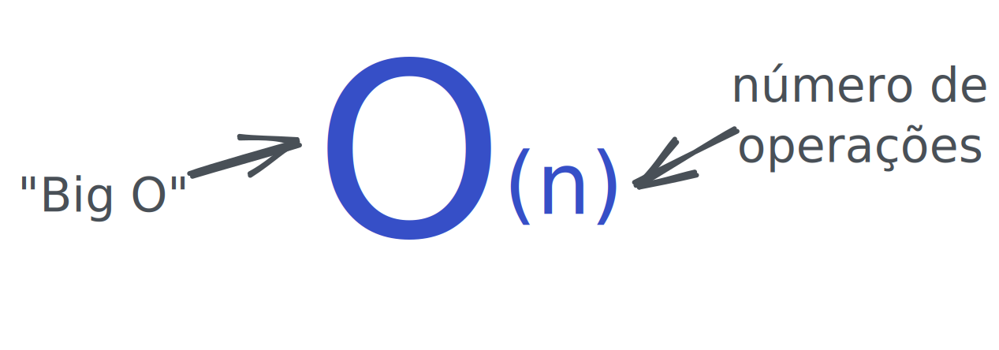

# Complexidade do código

Bom, acho que a primeira coisa que deve ser esclarecida é por que falar de complexidade? Acho que lendo o *subject* já dá para ter uma noção: precisamos fazer o push_swap usar a menor quantidade de movimentos possível! Ainda não ficou claro? Para sua sorte eu irei passar brevemente por todos os tópicos que considero importante a respeito do assunto. Borá lá! 👀

  

## O tempo

Nada de horas, minutos... Só tempo. Todo algoritmo quando é executado leva X tempo. Sempre devemos buscar implementar um algoritmo que leve menos tempo. Para ficar mais simples de visualizar darei um exemplo.

> Imagine que uma menina propõe uma brincadeira para advinhar o número em que ela está pensando entre 0 e 50.

Certo, temos uma brincadeira que envolve sorte, já que pode acontecer de você acertar o número na primeira tentativa. Qual seria o tempo, então? Quando falamos em tempo, sempre devemos pensar no __pior cenário__ possível que no caso é um tempo de 50 (50 tentativas). Percebe o quão ruim é essa abordagem? Se ao invés de 50 o valor máximo fosse 100000 o tempo já seria esses 100000. Ou seja, temos um tempo __linear__, já que o tempo sempre será o número máximo.

> Agora imagine que a menina pode responder com "Muito baixo" ou "Muito alto". O que muda?

Muda que isso já facilita muito nossa vida! Digamos que chutamos o número 23 e a menina diz "Muito alto", com isso já sabemos que todos os números depois do 23 podem ser descartados, restanto apenas os números entre 0 e 22. Assim, com um chute já conseguimos descartar metade das tentativas, sendo mais precisa, levamos log2n tempo. Bem menos complexo, não é?

    

## A notação Big O

Uhul, já sabemos sobre o tempo, agora vamos saber mais sobre o Ó grandão \o/ De forma resumida direta e prática, a notação Big O vai dizer o quão rápido nosso algoritmo é. Vamos voltar para nossos doias casos descritos lá em cima. O primeiro caso teria um tempo na notação big O de O(_n_), pois dado n entradas, ele leva essas n entradas de duração. Já o segundo caso seria O(_log2n_). Essa notação mostra o número de operações que são feitas. Ela informa o __quão rápido nosso algoritmo vai crescer :3__

Sendo assim, temos:

    

Curiosidade:
Essa notação é chamada de "Big O" simplesmente porque colocamos esse Ó grandão na frente do número de operações.

## Referências

- Entendendo algoritmos - Aditya Y. Bhargava

  

