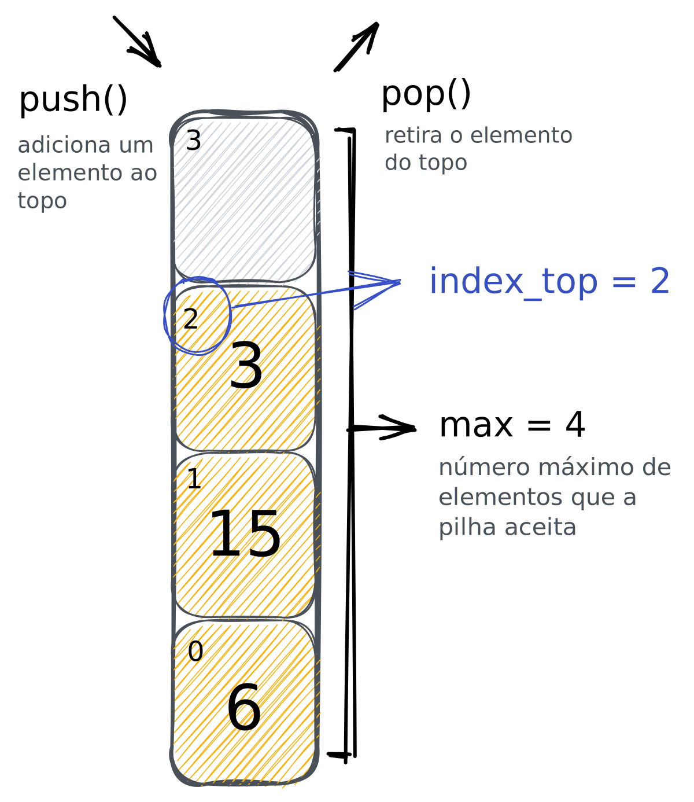

# Pilhas [DOING]

Uma pilha é uma lista em que todas as operações de inserção, remoção e acesso são feitas num mesmo extremo, denominado __topo__.

🧐 Características:

- Quando adicionamos um item na pilha, ele ficará no topo dela.
- Somente conseguimos acessar e remover o elemento do topo da pilha. Essa forma de acesso se chama __LIFO__ (Last-in/First-Out).

Alguns dos usos de pilha são: controle de acesso às páginas visitadas em um navegador e; controle de chamadas e retornos das funções em um programa. ~~e o push_Swap claro hahahaha~~

> Pilhas são bem úteis em situações que precisamos invertar a ordem de uma sequência.

<p align="center">
  
</p>

## Implementando uma pilha

A primeira coisa que seria legal fazer seria criar um tipo para representar nosso elemento da pilha. Mas por que isso? Bom, fazendo isso a gente consegue alterar rapidamente o tipo de dado que estamos inserindo na nossa pilha. Se o push_swap mudasse e amanhã passasse só aceitar chars como input, em uma linha mudamos isso... 

```c
typedef int t_stack_item;
```

Beleza, já temos a representação do elemento da pilha, agora precisamos definir a pilha em si. Nossa pilha tem um tamanho, ou seja, um número máximo de elementos permitidos, ela também tem um valor em seu topo, que aqui vamos representar pelo seu índice. E por fim, ela tem um ponteiro para onde os itens dela vão estar...

```c
typedef struct s_stack {
   int          max;
   int          index_top;
   t_stack_item *item;
} *t_stack;
```

<p align="center">
  
</p>

Beleza, temos nossa pilha, mas o que fazemos com ela? Bom podemos fazer as seguintes operações:

- Criar uma pilha: até agora só criamos o tipo pilha, precisamos ter uma função que crie ela dado um tamanho _stack_size_
- Verificar se a pilha está vazia: uma função simples que retorna 0 se a pilha estiver vazia, retorna 1 caso contrário
- Verificar se a pilha está cheia: igual a pilha vazia só que cheia -q
- Empilhar um item na pilha: dar o famoso push() na pilha hehe
- Desempilhar um item na pilha: agora é dar o famoso pop()
- Devolver o elemento que está no topo
- Destroir a pilha: sem leaks aqui meu caro 😎

### Criando uma pilha

```c
t_stack create_stack(int stack_size) {
   t_stack my_stack = malloc(sizeof(struct t_stack));
   P->max  = stack_size;
   P->stack_top = -1;
   P->item = malloc(stack_size*sizeof(t_stack_item));
   return my_stack;
}
```